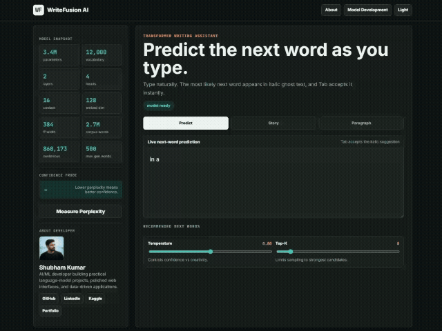
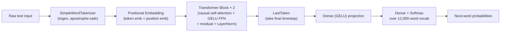
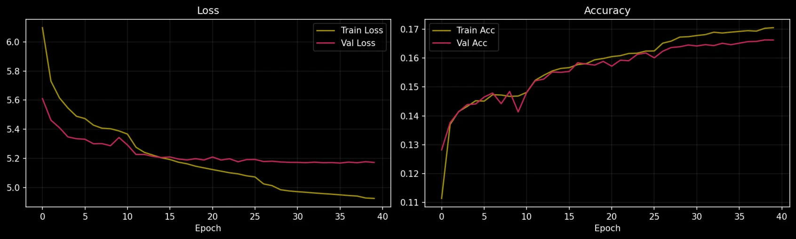

<div align="center">

# ✍️ WriteFusion AI

**A GPT-style Transformer language model, trained from scratch and served through a polished, interactive writing studio.**

Live next-word prediction · story & paragraph generation · 8 decoding strategies · attention visualization · perplexity probing

[](https://www.python.org/)
[](https://flask.palletsprojects.com/)
[](https://www.tensorflow.org/)
[](https://gunicorn.org/)
[](https://render.com/)


---

## Overview

**WriteFusion AI** ("NLP Engineer Studio" in-app) is an end-to-end language modeling project — not a wrapper around a third-party API. Every prediction you see comes from a **decoder-only Transformer built and trained from scratch in TensorFlow/Keras**, on a self-cleaned 2.7M-word English corpus, and served live through a Flask backend to a single-page vanilla-JS front end.

The app works like a minimal writing assistant: type in the editor and the model suggests the next word as italic "ghost text" (`Tab` to accept), or hand it a seed sentence and let it write full stories/paragraphs using any of 8 different sampling strategies. A built-in "Model Development" panel documents the entire pipeline — from raw text to deployed model — for anyone curious about how it actually works under the hood.

</div>
<div align="center">

</div>

---

## Table of Contents

- [Features](#features)
- [Architecture](#architecture)
- [Model Specs](#model-specs)
- [Training Results](#training-results)
- [Decoding Strategies](#decoding-strategies)
- [API Reference](#api-reference)
- [Project Structure](#project-structure)
- [Getting Started](#getting-started)
- [Deployment](#deployment)
- [Retraining on Your Own Corpus](#retraining-on-your-own-corpus)
- [Known Limitations & Notes](#known-limitations--notes)
- [Author](#author)

---

## Features

**Writing & prediction**
- Live next-word prediction as you type, rendered as inline italic "ghost text"
- One-key accept — `Tab` on desktop, `Enter` on mobile
- Ranked candidate words with probability chips, clickable to insert directly
- Story mode and Paragraph mode generate continuations inside the same editor, animated word-by-word

**Decoding control**
- 8 selectable strategies: Greedy, Temperature, Top-K, Top-P (nucleus), Top-K + Top-P, Typical sampling, Min-P, and a custom **Smart Anti-Repetition** mode
- Smart mode dynamically raises temperature/Top-K when a repetition score crosses a threshold, applies a repetition penalty over a recent token window, and blocks any n-gram that would repeat — then eases back once the model recovers

**Interpretability**
- Attention visualization — heatmapped tokens showing what the final Transformer block attended to when producing each word
- Perplexity probe — paste any text and get the model's confidence score on it (lower = more confident)
- In-app "Model Development" modal walking through all 12 stages of the pipeline: data collection → cleaning → tokenization → vocabulary → sequences → architecture → training config → evaluation → inference → decoding → generation → deployment

**UI/UX**
- Single-file responsive front end, light/dark theme with persisted preference
- Live model snapshot sidebar (params, vocab, layers, heads, context length, embed dim, corpus size — pulled straight from `model_config.json` at load time)
- Rotating example prompts, haptic feedback on mobile sliders, sticky sidebar layout

---

## Architecture

The model is a **causal (decoder-only) Transformer** — the same family as GPT — trained to predict the next word given the previous 16 words.



A few implementation details worth calling out, since they're what actually make the model loadable and correct rather than just architecturally sound on paper:

- **Custom `SimpleWordTokenizer`** — the standard Keras `Tokenizer` splits apostrophe-words inconsistently (`"don't"` → `"do"` + `"'"`), polluting the vocabulary with junk single-character tokens. A regex tokenizer (`[a-z]+(?:'[a-z]+)?`) keeps contractions and possessives as single tokens instead.
- **`LastToken` custom layer** — Keras blocks `Lambda` layers containing arbitrary Python from safe deserialization. A small named layer (`x[:, -1, :]`) replaces what would otherwise be a `Lambda`, so the saved `.keras` model can actually be reloaded inside Flask.
- **Causal masking** happens inside `TransformerBlock.call()` via a lower-triangular boolean mask passed to `MultiHeadAttention`, ensuring each position only attends to itself and earlier tokens.
- **Attention exposed for the UI** — each `TransformerBlock` stores `last_attn_scores` from its most recent forward pass; the Flask layer reads this off the final block, averages across heads, and returns the last row (attention *from* the newest token) to the front end for the heatmap.

---

## Model Specs

| Property | Value |
|---|---|
| Architecture | Decoder-only Transformer (GPT-style) |
| Vocabulary size | 12,000 words |
| Context length | 16 tokens |
| Embedding dimension | 128 |
| Attention heads | 4 |
| Transformer blocks | 2 |
| Feed-forward width | 384 |
| Dropout | 0.2 |
| Loss | Sparse categorical cross-entropy |
| Optimizer | AdamW (lr 0.001, weight decay 1e-4, clipnorm 1.0) |
| Precision | Mixed float16 (training) |
| Training corpus | 2.7M words · 860,173 sentences |

Parameter count is not hardcoded — it's computed live via `model.count_params()` when Flask loads `best_model.keras`, and shown in the UI sidebar (works out to roughly **3–3.5M parameters** for this configuration).

---

## Training Results

Trained on a T4-class GPU pipeline in Colab, with `EarlyStopping`, `ModelCheckpoint`, `ReduceLROnPlateau`, and `CSVLogger` callbacks. Based on the checked-in `training_log.csv`:

| Metric | Value |
|---|---|
| Best validation loss | ≈ 5.17 |
| Best validation accuracy | ≈ 16.5% |
| Perplexity at best checkpoint (`exp(val_loss)`) | ≈ 175 |
| Random-chance baseline (1 / 12,000) | 0.008% |

<div align="center">

</div>

16.5% top-1 accuracy sounds low in isolation, but next-word prediction over a 12k-word open vocabulary has many valid continuations for any given context — it's meaningfully better than the ~0.008% random baseline, and Top-K/Top-P sampling (rather than argmax) is what the app actually uses for generation, so it isn't relying on getting the single "correct" word right.

---

## Decoding Strategies

| Strategy | What it does |
|---|---|
| **Greedy** | Always picks the single highest-probability token |
| **Temperature** | Rescales the probability distribution before sampling — lower = safer/more repetitive, higher = riskier/more varied |
| **Top-K** | Samples only from the K most likely tokens |
| **Top-P (nucleus)** | Samples from the smallest set of tokens whose cumulative probability ≥ P |
| **Top-K + Top-P** | Applies both filters together |
| **Typical sampling** | Keeps tokens whose "surprise" is closest to the distribution's entropy, rather than just the most probable ones |
| **Min-P** | Drops any token below a probability threshold relative to the top candidate |
| **Smart Anti-Repetition** | Combines Top-K + Top-P with a repetition-score-driven feedback loop |

**How Smart Anti-Repetition works:** a repetition score is computed each step from repeated words, bigrams, and trigrams in the last 30 tokens. When it crosses `0.18`, temperature and Top-K are nudged upward (up to caps of 1.35 and 80); when repetition is low, they ease back toward the user's base settings. On top of that, a repetition penalty (1.2×, capped at 4 occurrences) down-weights recently used tokens, and a no-repeat-3-gram rule hard-blocks any token that would recreate a trigram already seen in the text.

---

## API Reference

| Route | Method | Purpose |
|---|---|---|
| `/` | GET | Renders the main UI |
| `/api/model-info` | GET | Returns model metadata (vocab size, params, layers, corpus stats) |
| `/api/complete` | POST | Single-step next-word candidates + attention weights |
| `/api/generate` | POST | Multi-step story/paragraph generation with a selectable decoding strategy |
| `/api/perplexity` | POST | Computes perplexity of a supplied piece of text |

<details>
<summary><b>POST /api/complete</b></summary>

```json
// Request
{ "text": "the sun was setting over", "temperature": 0.8, "top_k": 8 }

// Response
{
  "input_tokens": ["the", "sun", "was", "setting", "over"],
  "candidates": [{ "word": "the", "prob": 0.14 }, { "word": "a", "prob": 0.09 }],
  "attention": [0.02, 0.05, 0.11, 0.18, 0.64]
}
```
</details>

<details>
<summary><b>POST /api/generate</b></summary>

```json
// Request
{
  "text": "it was the best of",
  "max_words": 80,
  "decoding_strategy": "smart",
  "smart_anti_repetition": true,
  "temperature": 0.8,
  "top_k": 8,
  "top_p": 0.9
}

// Response
{
  "seed": "it was the best of",
  "generated": "it was the best of times ...",
  "steps": [{ "word": "times", "prob": 0.21, "decoding": { "strategy": "smart", "repetition_score": 0.0 } }]
}
```
</details>

<details>
<summary><b>POST /api/perplexity</b></summary>

```json
// Request
{ "text": "she looked at him and smiled" }

// Response
{ "perplexity": 142.7 }
```
</details>

---

## Project Structure

```
WriteFusion-AI/
├── app.py                     # Flask backend — model loading, inference, decoding, API routes
├── requirements.txt           # Runtime dependencies (Flask, TensorFlow, NumPy, Gunicorn, protobuf)
├── render.yaml                # Render deployment config (gunicorn, free plan)
├── runtime.txt                # Python version pin for deployment
├── make_corpus_stats.py       # Standalone script → generates corpus_stats.json for the UI
├── best_model.keras           # Trained model weights + architecture
├── tokenizer.pkl              # Pickled SimpleWordTokenizer (word_index / index_word)
├── model_config.json          # Hyperparameters read by app.py at startup
├── training_log.csv           # Per-epoch loss/accuracy history from training
├── static/                    # Profile photo + light/dark training plots (png + webp)
├── templates/
│   └── index.html             # Full single-file front end (HTML/CSS/JS)
└── ml_pipeline/
    ├── data_cleaning.py       # Colab notebook export — corpus cleaning & sentence splitting
    ├── model_tranning.py      # Colab notebook export — full training pipeline
    └── english_corpus_2.7M_word.txt   # Cleaned training corpus (132k lines)
```

---

## Getting Started

**Prerequisites:** Python 3.12 (TensorFlow does not yet support 3.14, and this project pins to 3.12).

```bash
git clone https://github.com/ShubhamAIML/WriteFusion-AI.git
cd WriteFusion-AI

python -m venv .venv
# Windows
.\.venv\Scripts\Activate.ps1
# macOS/Linux
source .venv/bin/activate

python -m pip install --upgrade pip
python -m pip install -r requirements.txt
python app.py
```

Open **http://127.0.0.1:5000**.

The app needs `best_model.keras`, `tokenizer.pkl`, and `model_config.json` in the same folder as `app.py` — all three are already committed to this repo, so a fresh clone works out of the box. Some TensorFlow CPU warnings (oneDNN, GPU-not-found, optimizer-variable-loading) are expected on a non-GPU machine and don't indicate failure; the app is healthy once it prints the local URL.

---

## Deployment

`render.yaml` is already configured for [Render](https://render.com/):

```yaml
buildCommand: pip install -r requirements.txt
startCommand: gunicorn app:app --bind 0.0.0.0:$PORT --timeout 120
```

One thing to double-check before deploying: `render.yaml` pins `PYTHON_VERSION: 3.11.0` while `runtime.txt` pins `python-3.12.8`. Depending on which one your Render environment honors, pick a single consistent version to avoid build surprises.

Also worth knowing: `best_model.keras` is **~66 MB**, committed directly to the repo. That's under GitHub's hard 100 MB file limit but past the point where GitHub starts warning — if the model grows on retraining, consider [Git LFS](https://git-lfs.com/) rather than committing it directly.

---

## Retraining on Your Own Corpus

The full training pipeline lives in `ml_pipeline/` as exported Colab notebooks (they still contain `!pip install` and `google.colab` calls, so they're meant to be run in Colab, not locally as-is):

1. **`data_cleaning.py`** — upload raw `.txt` files, flattens multi-line sentences, splits on `. ! ?`, lowercases, strips everything except letters/apostrophes/punctuation, dedupes, and exports one cleaned sentence per line.
2. **`model_tranning.py`** — loads the cleaned corpus, builds the `SimpleWordTokenizer`, creates sliding-window training sequences, builds and trains the Transformer, and saves `best_model.keras` / `tokenizer.pkl` / `model_config.json`.
3. **`make_corpus_stats.py`** — run locally after training to generate `corpus_stats.json` (sentence/word counts shown in the app UI). Without this file, the app falls back to the hardcoded defaults (860,173 sentences / 2.7M words) baked into `app.py`.

---

## Known Limitations & Notes

Being upfront about the current state, for anyone evaluating or extending this:

- **Model scale is intentionally small** (2 layers, 128-dim embeddings, 12k vocab) — this trades off generation quality for something trainable end-to-end on a free-tier Colab GPU. Validation perplexity (~175) reflects that; it's a solid learning/portfolio project, not a production-grade language model.
- **`ml_pipeline/` scripts are Colab exports**, not standalone CLI tools — they include `!pip install`, `drive.mount()`, and `google.colab.files` calls that only work inside a Colab notebook.
- **No `requirements.txt` for the training pipeline** — only the Flask app's runtime deps are pinned. Training additionally needs `matplotlib`.
- **Version pin mismatch** between `render.yaml` (Python 3.11.0) and `runtime.txt` (Python 3.12.8) — see [Deployment](#deployment).
- **No LICENSE file** is currently present in the repo — worth adding one (MIT is the common default for portfolio projects) so others know how they can use the code.

---

## Author

**Shubham Kumar** — AI/ML developer building practical language-model projects and data-driven applications.

[](https://github.com/ShubhamAIML)
[](https://www.linkedin.com/in/shubham-kumar-016b6816b/)
[](https://www.kaggle.com/shubham1921)
[](https://portfolio-mxx7.onrender.com/)
